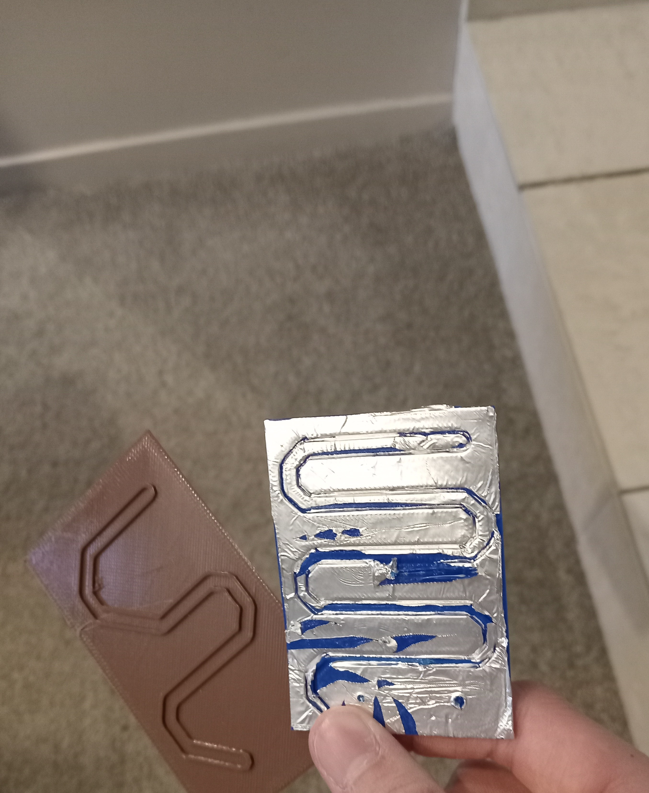
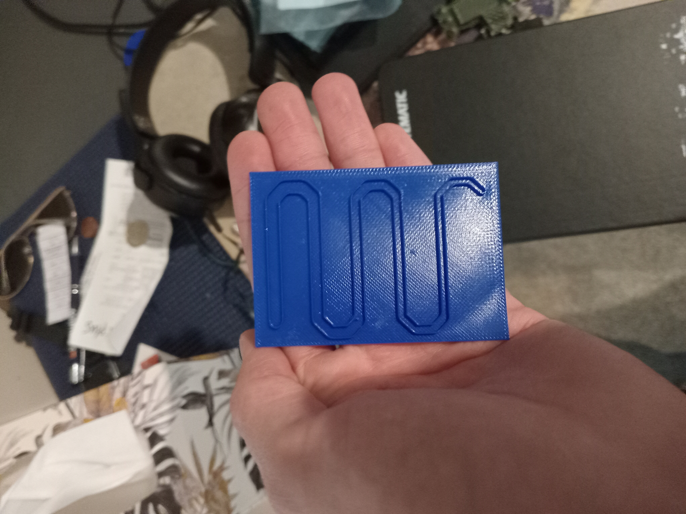
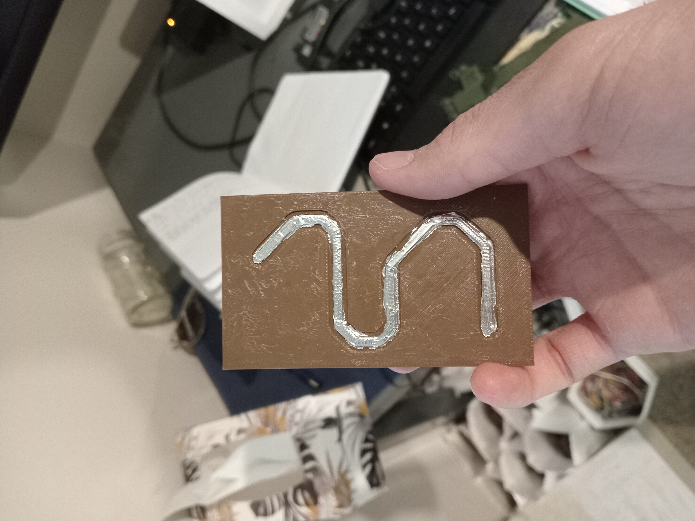

# 3DP-PCB-Generator
This was a project I was really keen to do, and it was supposed to provide a cookie-cutter effect on aluminium foil to make traces on a PCB. However, the traces never stuck well enough, so I ended early.
 

---
It works like this:

Cache is the folder with the project your currently working on (PCB files, setup config)

And active files is the results that change as the script runs.

Each python file has its job:

1_gerberpraser.py: Copys gerber and Exellon files from a PCB .zip into cache via a file explorer

2_autoduplicatechecker.py: Checks for any two files of the same type. If found, report error in error.txt

3_autooutlinechecker.py: Makes sure there is a outline, if not put error in error.txt

4_autoborder2json.py: Converts the .gko / .gm1 into a .json vertice shape in active files

5_autotopsilk2json.py: Converts the .gto shapes into .json vertice shapes

6_autotopmask2json.py: Converts the .gts shapes into .json vertice shapes

7_autotopcopper2json.py: Converts the .gtl shapes into .json vertice shapes

8_autotopcombiner.py: Combines all touching shapes in the top copper layer into one shape (Needed for next step)

9_autotopoutline.py: Adds circles and rectangles to the combined top copper layer of diameter "traceoutline" from config.json, making thick

10_autotopoutlinestl.py: Converts the thicker top copper traces into a 2d .stl file

11_autotopthickoutline.py: Adds circles and rectangles to the combined top copper layer of diameter "traceoutline" + "cutterwiggleroom" from config.json, making thicker traces (Gives wiggle room for cutter)

12_autotopnegthicktracestl.py: Keeps only empty space within the bounds of the PCB outline of the thicker top copper outline, then converts it to a 2d.stl

13_autotopnegmask.py: Makes a negitive soldermask 2d .stl, which would be overlayed on the cutout traces, exposing pads while keeping traces hidden

json_viewer.py: Allows you to view the .json vertice shape files via a file explorer:

